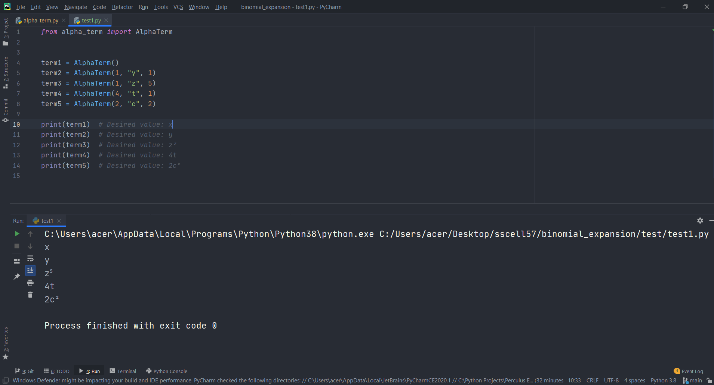
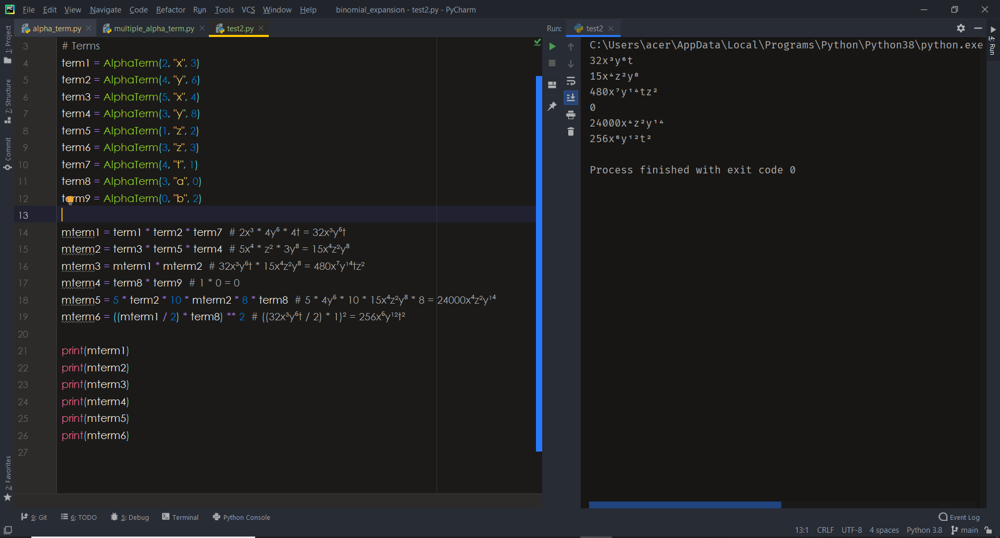

# exponential-expressions

**What does this repo do?**

This repo allows you to create exponential terms using unknown numbers comfortably. You can do various math applications using this repository. Like binomial expansion, derivative, integral...

```python
term1 = AlphaTerm(2, "x", 2)  # That means 2x²

print(term1.get_coefficient())
print(term1.get_alpha())
print(term1.get_exponent())
print(term1.get_printable_exponent())
print(term1)

>>> 2
>>> x
>>> 2
>>> ²
>>> 2x²
```


AlphaTerm class has multiple methods. 

```python
term1 = AlphaTerm(2, "x", 2)  # That means 2x²
term2 = term1 * 4 # That means 8x²
term3 = term2 ** 2  # That means 64x⁴
term4 = term1 * term2 * term3  # That means 1024x⁸
term5 = term4 / 8  # That means 128x⁸
```

_What if the alphas are different ?_ The answer is in the **MultipleAlphaTerm** class.

```python
term1 = AlphaTerm(3, "a", 4)
term2 = AlphaTerm(4, "b", 5)
m_term = term1 * term2  # This expression returns MultipleAlphaTerm(term1, term2)

print(m_term)

>>> 12a⁴b⁵
```

- _NOT: Operations such as exponentiation, division, multiplication can also be applied to objects in the MultipleAlpaTerm class._


### Examples


**_AlphaTerm Class Test_**




**_MultipleAlphaTerm Class Test_**




